# Top 32 Cloud Infrastructure Providers in 2025 (Comprehensive Review)

Choosing the right cloud platform shapes how fast you ship, how much you spend, and whether your infrastructure scales smoothly or breaks under pressure. Whether you're running a side project, scaling a startup, or managing enterprise workloads, the cloud provider you pick determines your deployment speed, cost predictability, and operational overhead.

This guide breaks down 32 cloud infrastructure providers across major cloud platforms, developer-focused hosts, and specialized services—covering everything from virtual machines and managed databases to serverless functions and edge computing.

## **[DigitalOcean](https://digitalocean.com)**

Developer-friendly cloud infrastructure built for simplicity, transparent pricing, and fast deployment without enterprise complexity.

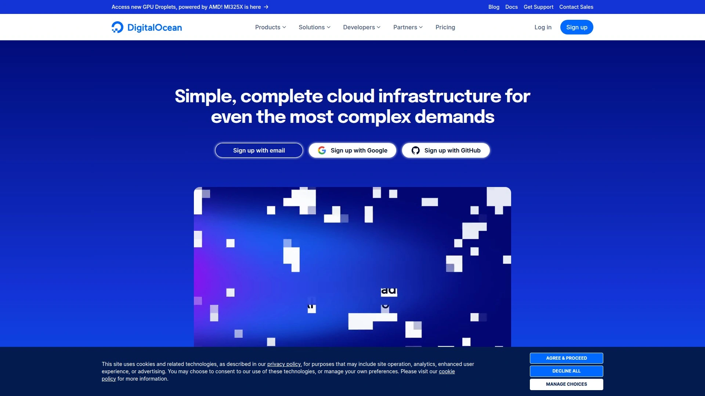

DigitalOcean delivers virtual machines called Droplets, managed Kubernetes, fully managed databases (PostgreSQL, MySQL, MongoDB, Redis, Kafka), and an App Platform for deploying code directly from GitHub. The platform targets developers and small-to-medium businesses who want cloud infrastructure without AWS-level complexity.

**What makes it stand out:** The interface is clean and intuitive, pricing is transparent with no hidden costs, and the community produces extensive tutorials and documentation. You can spin up a basic Droplet for predictable monthly rates, scale managed databases without managing backups manually, and deploy containerized applications through managed Kubernetes.

**Best for:** Startups and developers who prioritize ease of use over maximum feature depth, teams that want predictable monthly costs, and projects that need managed databases without complex configuration. The platform recently launched Gradient AI for agent development and serverless AI inference.

## **[Amazon Web Services (AWS)](https://aws.amazon.com)**

The largest cloud provider with the deepest service catalog, offering everything from basic compute to advanced machine learning and global edge infrastructure.

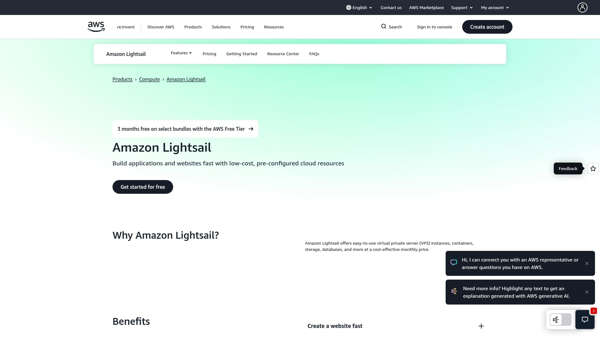

AWS provides EC2 virtual machines, S3 object storage, RDS managed databases, Lambda serverless functions, and over 200 other services spanning compute, storage, networking, AI/ML, and analytics. The platform dominates enterprise cloud with extensive compliance certifications and global data center coverage.

**Strengths:** Unmatched service breadth means you can build almost anything without leaving the ecosystem, mature tooling for enterprise deployments, and the largest partner ecosystem in cloud computing. AWS Outposts and Direct Connect enable hybrid cloud setups that connect on-premises infrastructure with cloud resources.

**Considerations:** Pricing complexity requires careful management—data transfer costs and service combinations can surprise you. The learning curve is steep, and cost optimization demands dedicated attention.

## **[Microsoft Azure](https://azure.microsoft.com)**

Enterprise-focused cloud platform with deep Microsoft product integration, strong hybrid cloud capabilities, and comprehensive compliance coverage.

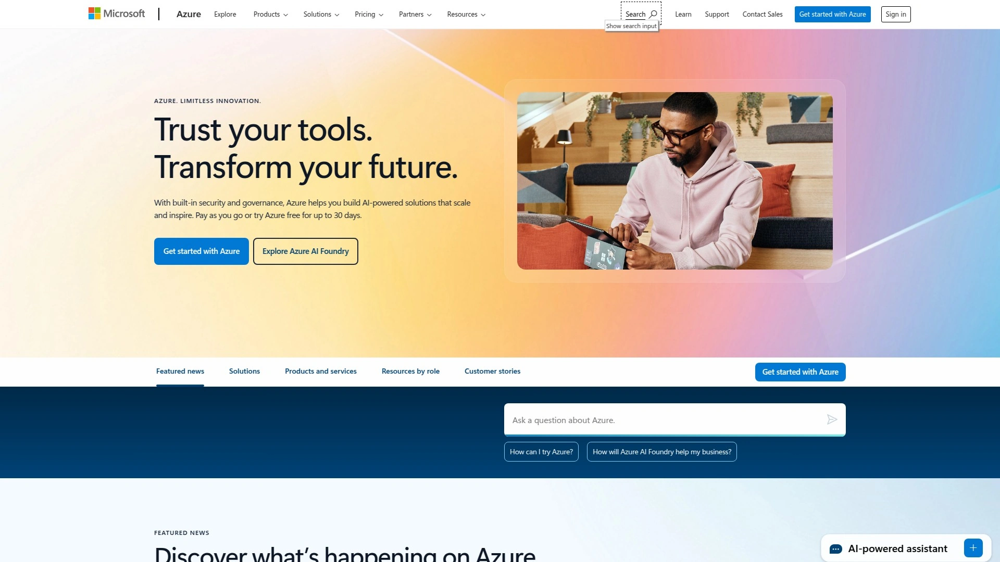

Azure offers virtual machines, Azure Kubernetes Service, managed SQL databases, Azure Functions for serverless computing, and seamless integration with Microsoft 365, Active Directory, and Windows Server. The platform excels in hybrid scenarios where organizations need to bridge on-premises and cloud infrastructure.

**Why choose it:** Native integration with Microsoft products makes Azure the obvious choice for organizations already invested in the Microsoft ecosystem. ExpressRoute provides private connections to Azure without traversing the public internet, and Azure Arc extends Azure management to any infrastructure.

**Best fit:** B2B SaaS companies integrating with Microsoft products, enterprises with existing Microsoft licensing agreements, and organizations requiring extensive compliance certifications for regulated industries.

## **[Google Cloud Platform (GCP)](https://cloud.google.com)**

Data and AI-focused cloud with industry-leading Kubernetes, BigQuery data warehousing, and machine learning infrastructure.

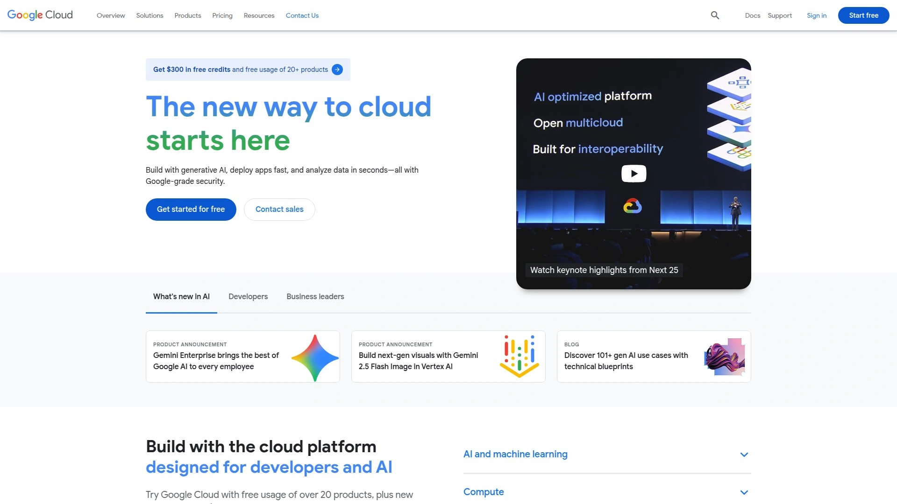

GCP provides Compute Engine VMs, Google Kubernetes Engine (the platform where Kubernetes originated), Cloud Storage, BigQuery for analytics, and Vertex AI for machine learning workloads. The platform excels in data-intensive applications and AI/ML workflows.

**Core advantages:** Best-in-class Kubernetes management since Google created the technology, superior data analytics with BigQuery, and competitive pricing for compute-intensive workloads. Live migration for VMs minimizes downtime during maintenance.

**Ideal for:** Startups building data-heavy products, teams running Kubernetes at scale, and organizations investing in AI/ML capabilities. Google's startup program offers credits for qualifying companies.

## **[Vultr](https://vultr.com)**

Performance-focused cloud provider offering bare metal servers, cloud compute, and extensive global coverage at competitive prices.

Vultr delivers cloud compute instances, bare metal servers, block storage, managed Kubernetes, and managed databases across 32 global locations. The platform supports hourly billing and provides bare metal options unavailable at DigitalOcean.

**Key differentiators:** Bare metal servers give you dedicated hardware without virtualization overhead, extensive OS options including custom ISOs, and consistent performance across instance types. Private networking comes standard, and deployment happens in under 60 seconds.

**Target users:** Developers who need bare metal performance, applications requiring specific OS configurations, and global applications needing low-latency deployment across continents.

## **[Linode (Akamai)](https://linode.com)**

Developer-friendly cloud platform known for transparent pricing, strong customer support, and comprehensive API access.

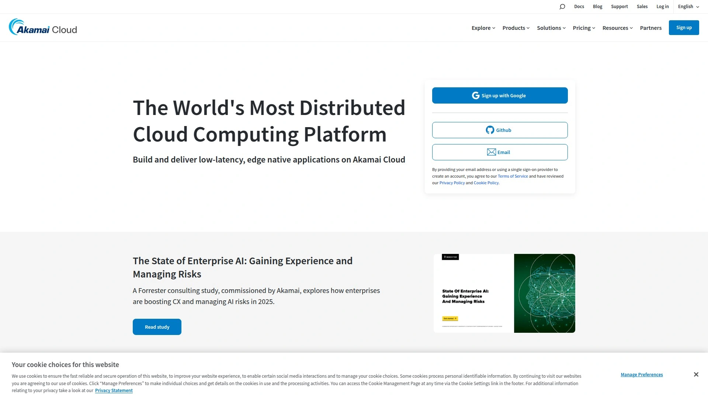

Linode provides shared and dedicated CPU VMs, block storage, object storage, managed Kubernetes, NodeBalancers for load balancing, and managed databases. After Akamai's acquisition, Linode gained access to Akamai's massive CDN and edge network.

**Standout features:** Transparent, simple pricing with generous included bandwidth, automated backups, and excellent customer support. API-first design enables easy automation, and the platform offers 4TB-5TB of pooled bandwidth even on entry-level instances.

**Best suited for:** Developers who value straightforward pricing and strong support, projects needing API-driven infrastructure management, and teams wanting reliable performance without complexity.

## **[Hetzner Cloud](https://hetzner.cloud)**

European cloud provider delivering exceptional price-to-performance ratio with generous bandwidth and straightforward pricing.

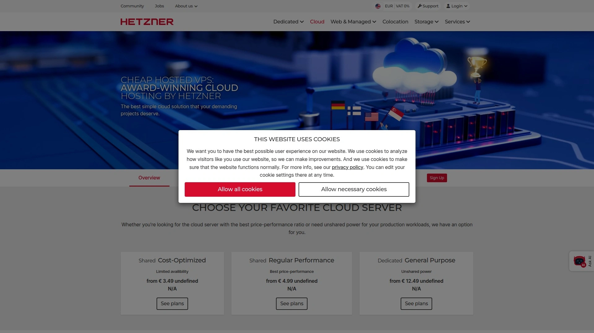

Hetzner offers cloud servers, dedicated servers, block storage volumes, load balancers, and extensive bandwidth allowances (20TB included per server in European locations). The platform originates from Germany and maintains strong European data center presence.

**Pricing advantage:** Significantly cheaper than competitors for equivalent resources—you can get 4 vCPU and 8GB RAM for under $8/month compared to $48 at Linode. Block storage and bandwidth costs are notably lower than major cloud providers.

**Limitations:** Manual scaling requires more hands-on management compared to automated scaling at other platforms, and data center options focus primarily on Europe. Best for European-focused projects and cost-conscious teams willing to handle more infrastructure management.

## **[Oracle Cloud Infrastructure (OCI)](https://oracle.com/cloud)**

Enterprise cloud platform specializing in database performance, high-performance computing, and industry-specific compliance.

OCI provides compute instances, autonomous databases, container engine for Kubernetes, object storage, and specialized services for database-heavy workloads. The platform emphasizes security-first architecture and offers bare metal compute options.

**Database strength:** Oracle's database expertise translates to exceptional managed database performance and autonomous database features that self-tune and self-patch. OCI delivers competitive pricing compared to AWS and Azure for equivalent resources.

**Target audience:** Enterprises requiring high-performance database deployments, organizations in regulated industries needing robust compliance features, and startups seeking cost-efficient enterprise-grade infrastructure.

## **[IBM Cloud](https://ibm.com/cloud)**

Hybrid and multi-cloud platform focused on enterprise workloads, security, and industry-specific solutions.

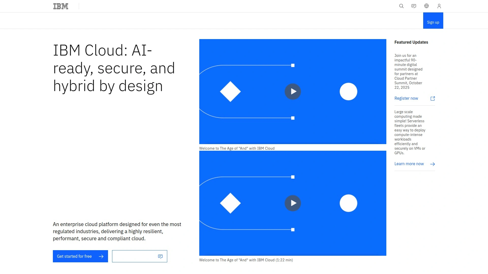

IBM Cloud offers bare metal servers, virtual servers, managed Kubernetes (Red Hat OpenShift), Watson AI services, and blockchain capabilities. The platform provides extensive hybrid cloud features for bridging legacy systems with modern cloud infrastructure.

**Enterprise focus:** Deep integration with Red Hat OpenShift for enterprise Kubernetes, industry-specific cloud solutions for financial services and healthcare, and strong focus on data governance and security. IBM's quantum computing services are accessible through the cloud platform.

**Recommended for:** Enterprises in regulated industries requiring specialized compliance, organizations running Red Hat infrastructure, and teams needing hybrid cloud capabilities for legacy system integration.

## **[Render](https://render.com)**

Modern platform-as-a-service that simplifies cloud deployment with managed services and automatic operations.

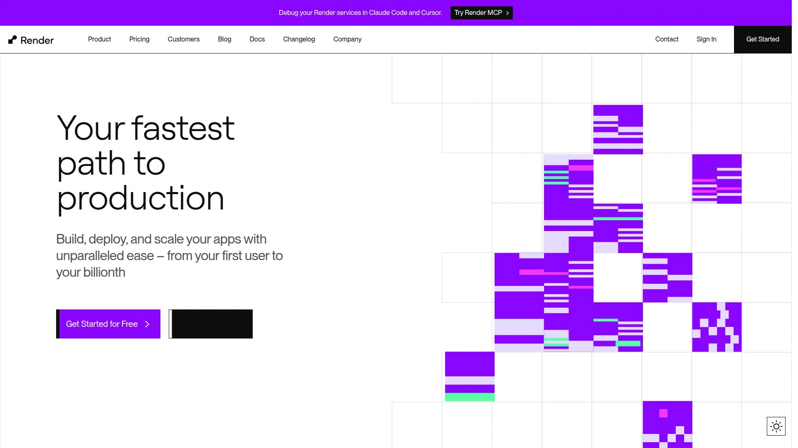

Render provides web services, background workers, cron jobs, PostgreSQL and Redis databases, and static site hosting—all deployable from GitHub with zero configuration. The platform handles SSL certificates, health checks, and zero-downtime deployments automatically.

**Developer experience:** Git-push deployment from GitHub, automatic preview environments for pull requests, and managed databases without manual backup configuration. Infrastructure-as-code through Blueprints defines entire applications in YAML.

**Pricing model:** Instance-based pricing with fixed monthly costs per service tier. Predictable but can lead to over-provisioning or under-provisioning compared to usage-based models.

**Ideal for:** Teams wanting Heroku simplicity without Heroku pricing, full-stack applications needing managed databases, and projects benefiting from automatic infrastructure management.

## **[Railway](https://railway.app)**

Developer-focused platform with usage-based pricing and Git-centric deployment workflows.

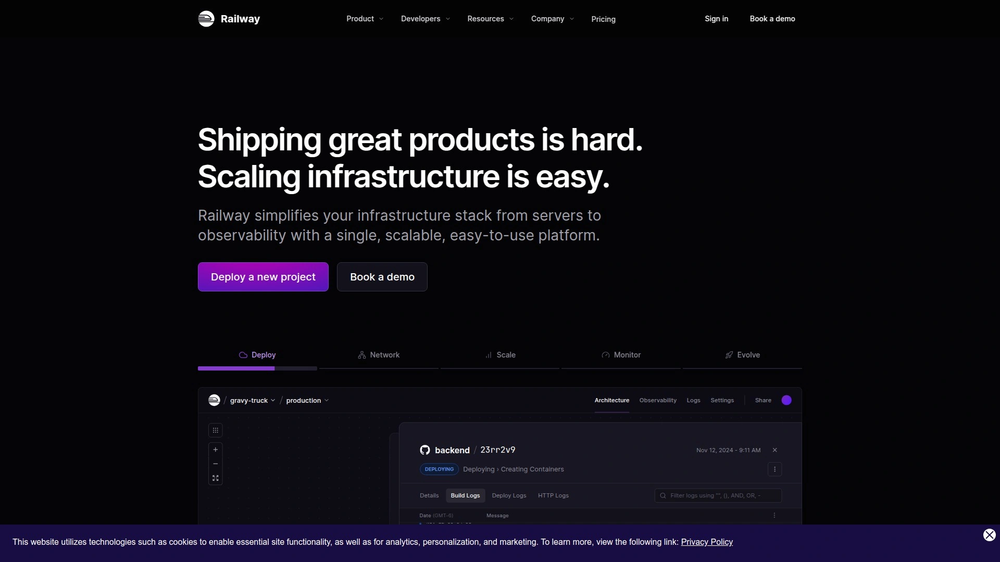

Railway offers deployment from GitHub or Docker images, managed PostgreSQL and Redis databases, private networking, and ephemeral environments for testing. The platform recently introduced a plugin ecosystem for community extensions.

**Pricing approach:** Usage-based model charging for active compute time multiplied by resource consumption (CPU and memory). You pay only for what you actually use rather than provisioning fixed instance sizes.

**Infrastructure:** Railway runs on owned hardware in global data centers, controlling the full stack from hardware to networking. This enables competitive pricing while maintaining performance.

**Best for:** Projects with variable traffic patterns that benefit from usage-based pricing, developers wanting fast deployment without infrastructure management, and teams needing cost-effective hosting for multiple services.

## **[Fly.io](https://fly.io)**

Edge-focused platform running applications globally close to users through distributed infrastructure.

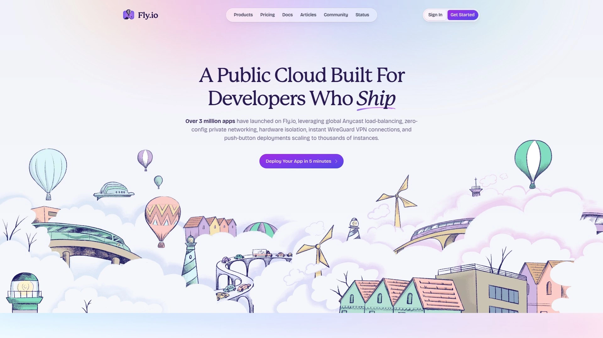

Fly.io deploys Docker containers to Fly Machines across global regions, automatically routing traffic to the nearest instance. The platform emphasizes edge computing and low-latency global deployment.

**Edge capabilities:** Applications run near users worldwide, reducing latency significantly compared to single-region deployments. Fly Machines enable super-fast container instantiation for scaling.

**Technical approach:** More hands-on than Render or Railway, requiring Docker knowledge and infrastructure configuration. Offers granular control over deployment regions and networking.

**Recommended for:** Global applications needing low-latency worldwide, developers comfortable with Docker and infrastructure details, and use cases where edge computing provides clear benefits.

## **[Vercel](https://vercel.com)**

Frontend platform optimized for Next.js with automatic optimizations and global edge deployment.

Vercel provides seamless Next.js deployment, serverless functions, edge functions, built-in analytics, and incremental static regeneration. The platform was created by the Next.js team, offering the tightest integration available.

**Next.js integration:** Zero-configuration deployment for Next.js applications, automatic code splitting and optimization, and instant rollbacks to previous deployments. Image optimization and font loading happen automatically.

**Free tier:** 100GB bandwidth monthly, unlimited custom domains, SSL certificates, and 100,000 serverless function invocations daily. Commercial use is permitted on the free tier.

**Best choice for:** Next.js applications where tight integration matters most, frontend teams wanting automatic performance optimizations, and projects benefiting from Vercel's edge network.

## **[Netlify](https://netlify.com)**

All-around JAMstack platform with extensive features, plugins ecosystem, and excellent developer experience.

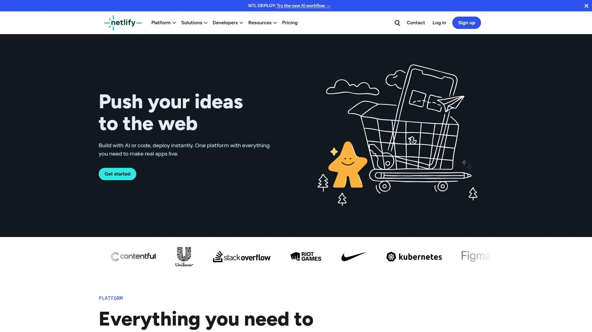

Netlify offers static site hosting, serverless functions, form handling, identity management, split testing, and deploy previews. The platform popularized JAMstack architecture and maintains the most mature ecosystem.

**Plugin ecosystem:** Extensive marketplace of plugins for build-time functionality, built-in forms without backend code, and authentication through Netlify Identity. Deploy previews automatically create test URLs for every pull request.

**Versatility:** Framework-agnostic support for React, Vue, Svelte, and any static site generator. Background functions enable long-running tasks beyond typical serverless limits.

**Ideal for:** JAMstack applications beyond Next.js, teams needing built-in forms and auth, and projects benefiting from extensive build plugins.

## **[Cloudflare Pages](https://pages.cloudflare.com)**

High-performance frontend platform leveraging Cloudflare's global network with unlimited bandwidth.

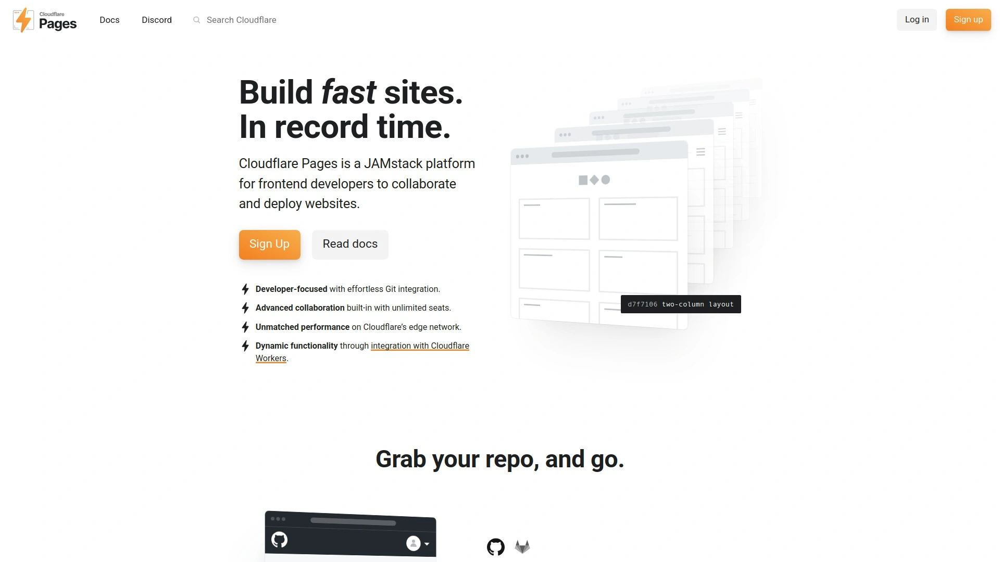

Cloudflare Pages provides static site hosting, serverless functions through Workers integration, unlimited bandwidth on free tier, and deployment across 300+ edge locations. The platform runs on Cloudflare's massive CDN infrastructure.

**Performance edge:** Cloudflare's network spans more locations than competitors, delivering exceptionally fast global performance. Average TTFB is consistently lower than Vercel or Netlify.

**Free tier generosity:** Unlimited bandwidth with no caps, 500 builds monthly, and 100,000 function requests daily. Perfect for high-traffic sites on tight budgets.

**Best for:** Performance-critical applications requiring minimal latency worldwide, high-traffic sites needing unlimited bandwidth, and teams already using Cloudflare Workers.

## **[Heroku](https://heroku.com)**

Pioneering platform-as-a-service with simple git-push deployment and extensive add-on marketplace.

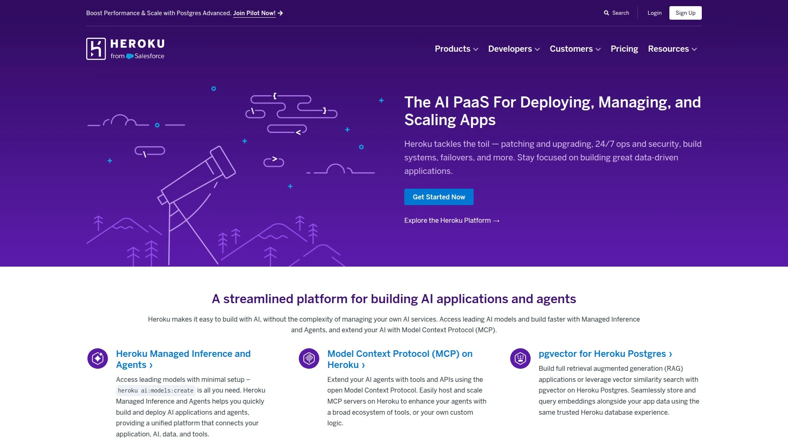

Heroku enables deployment via git push, managed PostgreSQL and Redis, support for multiple programming languages (Python, Node.js, Ruby, Java, PHP, Go), and plug-and-play add-ons. The platform was acquired by Salesforce and targets rapid application deployment.

**Simplicity:** Deploy applications with a single command, scale dynos (containers) with simple sliders, and add services through marketplace add-ons. GitHub integration enables automatic deployments on code push.

**Pricing reality:** Historically simple but became expensive compared to modern alternatives. Many teams have migrated to Render, Railway, or Fly.io for cost reasons.

**Still relevant for:** Teams prioritizing absolute simplicity over cost, projects with Salesforce integration needs, and applications already running on Heroku with migration friction.

## **[UpCloud](https://upcloud.com)**

Finnish cloud provider emphasizing performance, MaxIOPS storage technology, and flexible infrastructure.

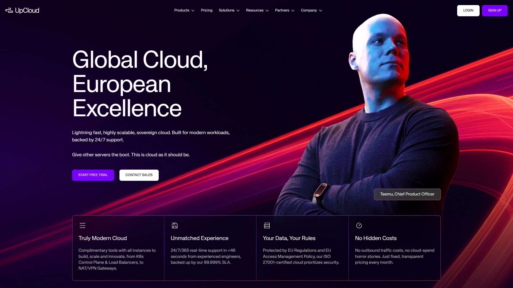

UpCloud offers cloud servers with MaxIOPS storage delivering exceptional disk performance, managed databases, Kubernetes, and simple scaling options. The platform operates data centers across Europe, North America, and Asia.

**Performance focus:** MaxIOPS storage technology claims to be the fastest in the industry for disk operations. Servers boot in under 45 seconds with consistent performance.

**Reliability:** 100% uptime SLA for production environments, automated backups, and private networking included.

**Recommended for:** Applications requiring high disk I/O performance, European and North American deployments, and teams wanting reliable infrastructure with strong SLAs.

## **[OVHcloud](https://ovhcloud.com)**

European cloud provider offering diverse services from shared hosting to bare metal servers at competitive prices.

OVHcloud provides cloud instances, dedicated servers, private cloud, object storage, and managed Kubernetes across 22 global data centers. The company operates extensive European infrastructure with GDPR-compliant hosting.

**Service range:** From budget VPS to enterprise dedicated servers, covering hosting needs from simple websites to complex infrastructure. Bare metal options compete with cloud providers on price.

**European strength:** Strong presence in European markets with local support and data sovereignty compliance. Competitive pricing compared to major hyperscalers.

**Best suited for:** European organizations requiring GDPR compliance, projects needing cost-effective dedicated servers, and teams wanting diverse hosting options under one provider.

## **[Scaleway](https://scaleway.com)**

French cloud provider with developer-friendly services, competitive pricing, and European data centers.

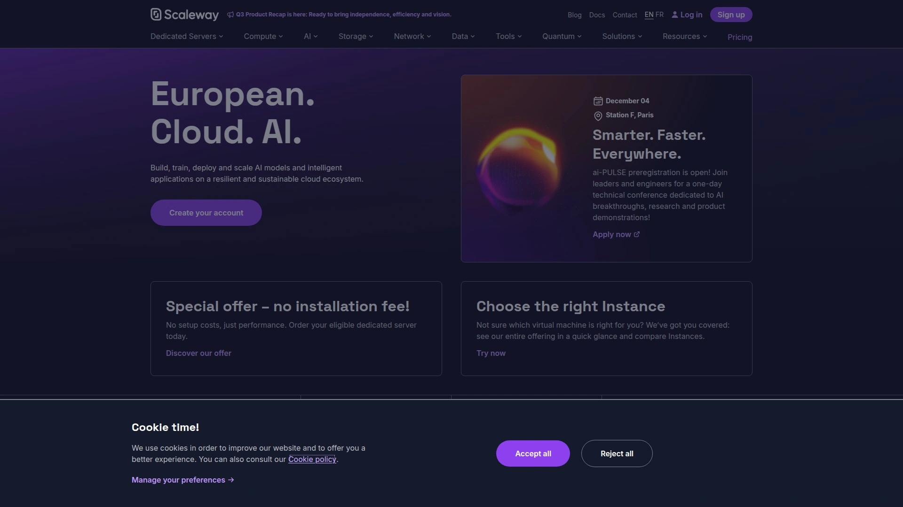

Scaleway offers cloud instances, bare metal servers, object storage, managed databases, Kubernetes, and serverless functions. The platform focuses on European infrastructure with French, Netherlands, and Polish data centers.

**European alternative:** Provides full cloud stack with European data residency for compliance requirements. Pricing is competitive for European deployments compared to US-based providers.

**Managed services:** Includes managed PostgreSQL, MySQL, and Redis with automatic backups and scaling. Serverless containers and functions enable pay-per-use compute.

**Target users:** European developers and companies requiring data sovereignty, cost-conscious teams, and organizations building on European infrastructure.

## **[Kamatera](https://kamatera.com)**

Global cloud infrastructure provider with 24 data centers offering highly customizable virtual machines.

Kamatera provides fully customizable cloud servers where you configure CPU, RAM, storage, and OS independently. The platform operates data centers across North America, Europe, Asia, and the Middle East.

**Customization depth:** Select exact resource allocations rather than predefined instance sizes. Deploy servers in seconds with granular control over specifications.

**Global reach:** 24 worldwide data center locations enable low-latency deployments near target users. Includes managed cloud hosting and load balancing.

**Ideal for:** Organizations needing custom resource configurations, global applications requiring specific regional presence, and teams wanting full infrastructure control.

## **[Cloudways](https://cloudways.com)**

Managed cloud hosting platform that simplifies deployment on AWS, Google Cloud, DigitalOcean, Vultr, and Linode.

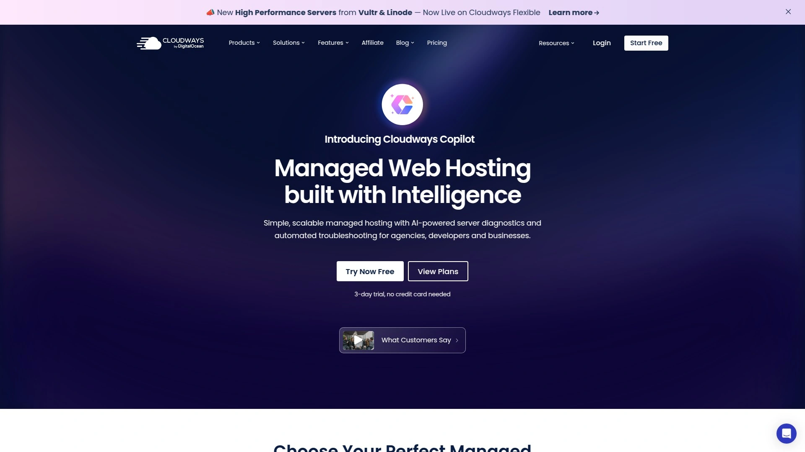

Cloudways acts as a management layer on top of major cloud providers, offering automated server management, application deployment (WordPress, Magento, Laravel), built-in caching, and staging environments. The platform handles server updates, security, and performance optimization automatically.

**Management convenience:** Deploy applications on DigitalOcean or AWS infrastructure without managing servers directly. Built-in CDN, SSL certificates, and automatic backups come included.

**Flexibility:** Choose your underlying infrastructure (AWS, Google Cloud, DigitalOcean) while Cloudways handles management. Useful for teams wanting cloud power without operational overhead.

**Best for:** WordPress and PHP application hosting, teams wanting managed infrastructure without hiring DevOps, and agencies managing multiple client websites.

## **[AWS Lightsail](https://aws.amazon.com/lightsail)**

Simplified AWS service offering predictable pricing and pre-configured application blueprints.

Lightsail provides virtual private servers with fixed resource allocations, pre-configured application stacks (WordPress, LAMP, Node.js), static IP addresses, and simplified networking. The service targets users who want AWS infrastructure without AWS complexity.

**Simplicity within AWS:** Predictable monthly pricing unlike standard AWS billing, one-click application deployment, and straightforward management console. Connects to broader AWS services when needed.

**Resource bundles:** Each instance includes fixed memory, CPU, SSD storage, and data transfer allowances. Easier to predict costs compared to EC2 with its numerous pricing dimensions.

**Recommended for:** AWS users wanting predictable costs, simple websites and applications on AWS infrastructure, and teams transitioning from shared hosting to cloud.

## **[HPE GreenLake](https://hpe.com/greenlake)**

Hybrid cloud platform delivering cloud services on-premises with consumption-based pricing.

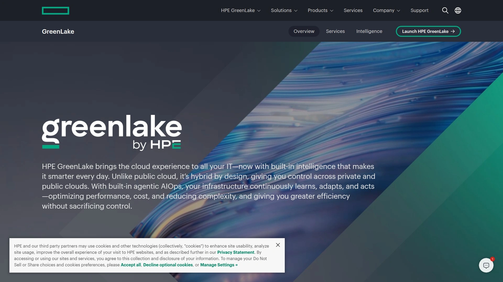

HPE GreenLake brings cloud flexibility to your own data center through managed infrastructure deployed on your premises. Services include compute, storage, containers, and specialized workloads with pay-per-use billing.

**Hybrid approach:** Combines on-premises control with cloud-like flexibility and billing. Ideal for organizations with strict compliance requirements or latency needs that prevent full cloud migration.

**Managed services:** HPE manages the infrastructure in your data center, handling updates, monitoring, and capacity planning. Unified platform across multiple workloads.

**Target market:** Enterprises requiring on-premises infrastructure for compliance or performance, organizations modernizing IT without full cloud migration, and teams needing hybrid cloud setups.

## **[Huawei Cloud](https://huaweicloud.com)**

Chinese cloud provider expanding globally with services across 170 countries and multiple global regions.

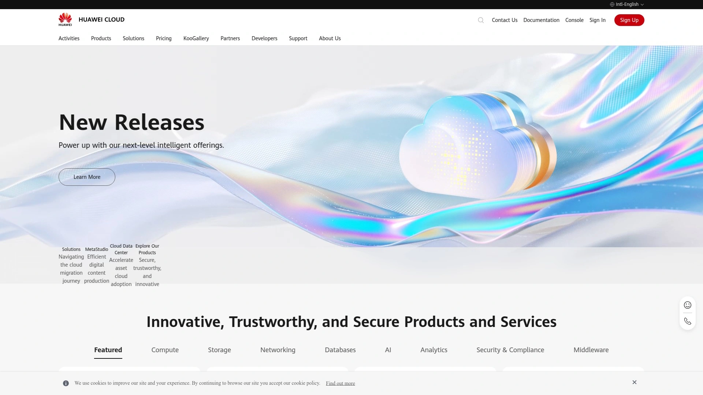

Huawei Cloud offers compute, storage, databases, AI services, and networking across global data centers. The platform holds approximately 18% of the Chinese cloud market and is expanding international presence.

**Growth trajectory:** Rapidly expanding beyond China with data centers in Asia-Pacific, Europe, Latin America, and Africa. Provides localized services and support in target markets.

**Service portfolio:** Full cloud stack including compute instances, object storage, managed databases, and AI/ML services comparable to major providers.

**Considerations:** Strong option for businesses operating in Asia-Pacific and China, organizations requiring Chinese data residency, and companies with existing Huawei partnerships.

## **[Dell Technologies Cloud](https://delltechnologies.com/cloud)**

Multi-cloud platform integrating VMware software with Dell infrastructure for hybrid deployments.

Dell Technologies Cloud combines VMware Cloud Foundation with Dell's infrastructure hardware, enabling consistent operations across on-premises and public cloud. The platform emphasizes data protection and storage services.

**VMware integration:** Built on VMware virtualization, providing familiar management for organizations already running VMware. Seamless workload mobility between environments.

**Hybrid strength:** Designed specifically for hybrid cloud strategies bridging legacy infrastructure with modern cloud capabilities. Enterprise-grade security and compliance features.

**Best for:** Enterprises running VMware infrastructure, organizations requiring hybrid cloud deployments, and teams prioritizing data protection and storage services.

## **[Cisco Cloud Solutions](https://cisco.com/cloud)**

Multi-cloud networking and security platform emphasizing hybrid cloud connectivity.

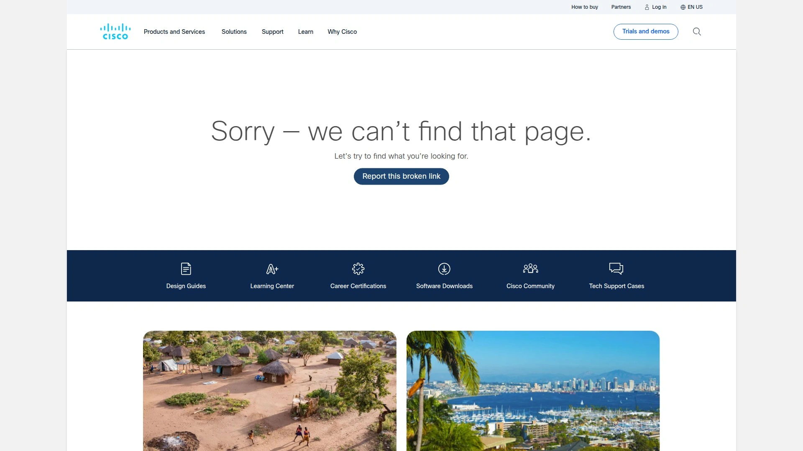

Cisco provides cloud networking, security solutions, multi-cloud integration, and hybrid cloud infrastructure. The platform leverages Cisco's networking expertise for cloud connectivity.

**Networking focus:** Optimizes workloads across multiple clouds, seamless integration between environments, and advanced networking capabilities. Strong security protocols ensure data integrity and privacy.

**Multi-cloud management:** Simplifies operating workloads across AWS, Azure, and Google Cloud simultaneously. User-friendly interfaces reduce cloud management complexity.

**Recommended for:** Organizations with existing Cisco networking infrastructure, multi-cloud deployments requiring sophisticated networking, and teams prioritizing security and connectivity.

## **[Northflank](https://northflank.com)**

Developer platform combining Kubernetes power with simplified deployment workflows and team collaboration features.

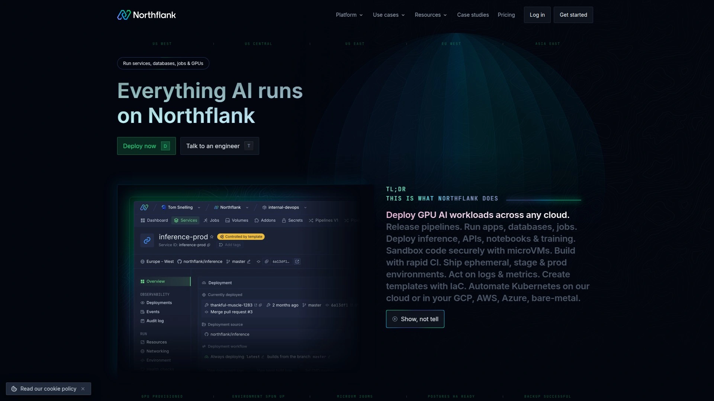

Northflank provides managed Kubernetes with simplified interfaces, Git-integrated deployments, preview environments, and team collaboration tools. The platform targets teams wanting Kubernetes capabilities without operational complexity.

**Kubernetes simplified:** Access Kubernetes features through developer-friendly interfaces without managing control planes. Deploy from Git repositories with automatic builds and rollbacks.

**Team features:** Built-in collaboration, role-based access control, and shared environments for development teams. Cost monitoring and resource optimization built into the platform.

**Best suited for:** Teams wanting Kubernetes without dedicated platform engineers, microservices architectures requiring orchestration, and organizations scaling beyond simple PaaS offerings.

## **[Qovery](https://qovery.com)**

Internal developer platform that deploys applications to AWS, GCP, or Azure with self-service developer workflows.

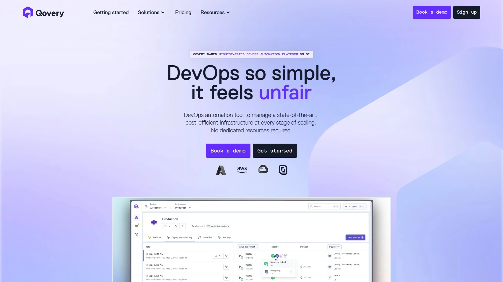

Qovery connects to your cloud account and manages infrastructure, enabling developers to deploy applications without infrastructure knowledge. The platform creates developer self-service on top of AWS, GCP, or Azure.

**Self-service approach:** Developers deploy applications independently while DevOps teams maintain control over underlying infrastructure. Standardizes deployments across teams.

**Infrastructure flexibility:** Runs on your cloud accounts (AWS, GCP, Azure), avoiding vendor lock-in to a specific PaaS provider. You own the infrastructure while Qovery manages it.

**Target audience:** Engineering teams wanting developer self-service, organizations avoiding PaaS lock-in, and companies building internal developer platforms.

## **[Blossom](https://boltops.com/blossom)**

Simple deployment platform focusing on straightforward workflows without excessive abstraction.

Blossom provides deployment automation with minimal complexity, focusing on clarity and simplicity over extensive features. The platform targets teams frustrated with overcomplicated alternatives.

**Simplicity philosophy:** Reduces deployment complexity to essential functions without overwhelming developers with options. Straightforward pricing and transparent operations.

**Refreshing alternative:** Aims to provide deployment convenience without the lock-in or pricing surprises of established platforms. Suitable for teams wanting simple, clear deployment workflows.

**Ideal for:** Small teams prioritizing simplicity, projects not requiring extensive platform features, and developers seeking alternatives to complex PaaS offerings.

## **[Neon](https://neon.tech)**

Serverless PostgreSQL with automatic scaling, branching, and pay-per-use pricing.

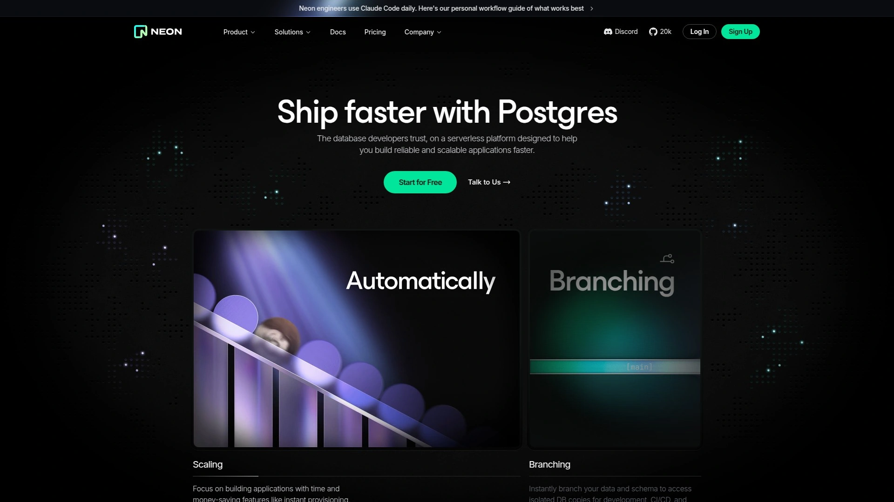

Neon offers PostgreSQL databases that scale to zero when idle, database branching for development workflows, and storage-compute separation. The platform charges only for actual compute time used.

**Serverless approach:** Databases automatically scale down to zero during inactivity, resuming instantly on connection. Reduces costs for variable-usage applications significantly.

**Developer features:** Branch databases like Git repositories for testing and development, instant database copies without duplicating storage, and GitHub integration.

**Best for:** Applications with variable database usage, development teams needing separate database environments, and cost-conscious projects paying only for active database time.

## **[Upstash](https://upstash.com)**

Serverless data platform for Redis and Kafka with per-request pricing and global edge deployment.

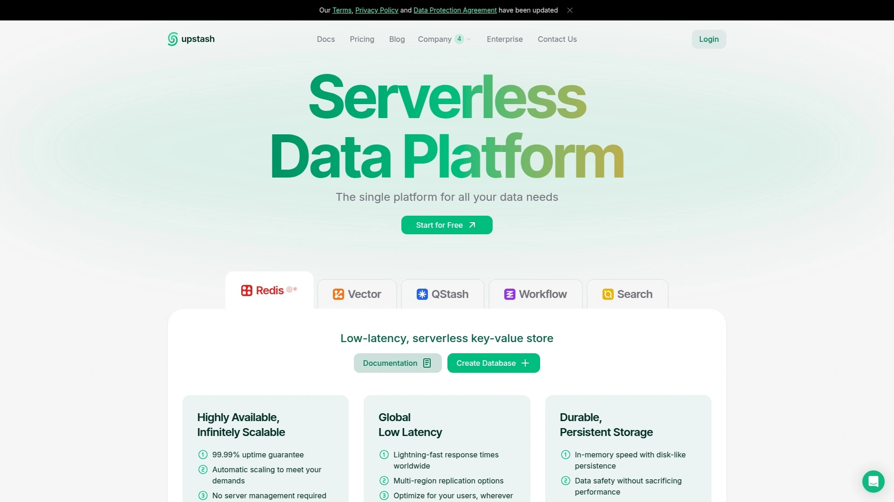

Upstash provides serverless Redis for caching and data storage, serverless Kafka for messaging, and edge-compatible APIs. Both services charge per request rather than fixed instance costs.

**Serverless Redis:** Redis functionality without managing servers, automatic scaling, and global replication for low-latency access worldwide. Pay only for requests made.

**Edge compatibility:** Works with edge functions at Vercel, Cloudflare Workers, and other edge platforms. Optimized for serverless and edge computing environments.

**Recommended for:** Serverless applications needing Redis or Kafka, edge computing use cases, and projects with variable data layer usage benefiting from per-request pricing.

## **[Trigger.dev](https://trigger.dev)**

Background job platform with built-in scheduling, retries, and observability for long-running tasks.

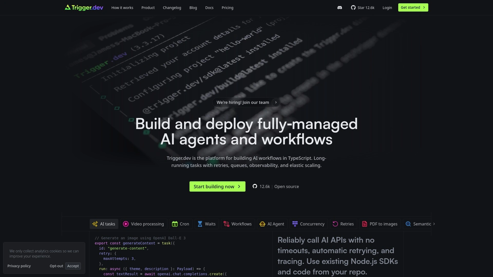

Trigger.dev handles background jobs, scheduled tasks, and event-driven workflows with automatic retries and monitoring. The platform integrates with existing applications for offloading heavy processing.

**Job management:** Runs long-duration tasks beyond serverless function limits, automatic retry logic for failed jobs, and detailed execution logs. Jobs can run for hours without timeout restrictions.

**Developer experience:** Type-safe APIs, local development environment, and visual dashboard for monitoring job execution. Integrates with frameworks like Next.js and Remix.

**Best suited for:** Applications needing background processing, scheduled task execution, and workflows requiring retry logic and observability.

## **[Kuberns](https://kuberns.com)**

AWS-grade infrastructure at reduced costs, offering cloud services optimized for startups and growing companies.

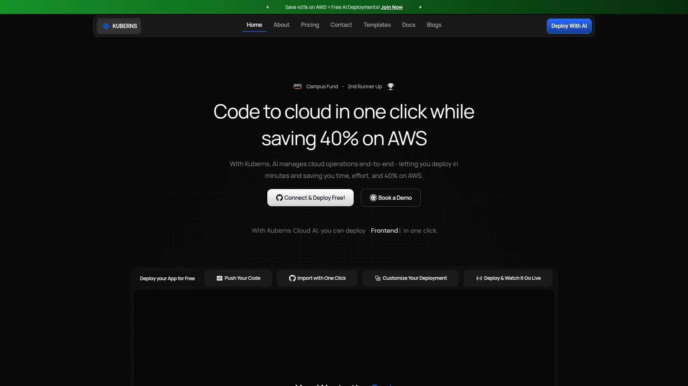

Kuberns delivers cloud infrastructure with AWS-equivalent performance at lower price points. The platform focuses on providing enterprise capabilities with startup-friendly pricing.

**Cost efficiency:** Comparable performance to major cloud providers at significantly reduced costs. Transparent pricing without hidden charges.

**Infrastructure quality:** Enterprise-grade reliability and performance without enterprise-level pricing. Suitable for startups scaling infrastructure needs.

**Target market:** Startups and growing companies needing reliable infrastructure without major provider costs, teams optimizing cloud spending, and organizations requiring predictable pricing.

## **[PlanetScale](https://planetscale.com)**

Serverless MySQL platform with horizontal scaling, branching workflows, and zero-downtime schema changes.

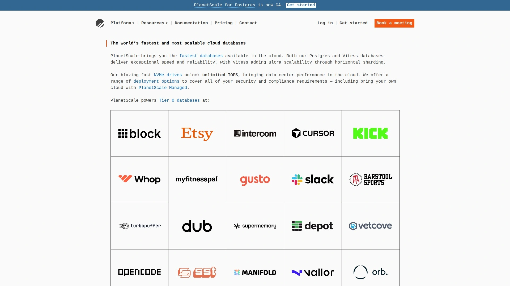

PlanetScale provides MySQL-compatible databases that scale horizontally through sharding, database branching similar to Git, and non-blocking schema migrations. The platform is built on Vitess, the technology YouTube uses to scale MySQL.

**Scaling capabilities:** Horizontal sharding distributes data across multiple servers for massive scale, automatic failover ensures high availability, and performance insights identify optimization opportunities.

**Developer workflow:** Branch databases for development and testing, deploy schema changes without locking tables, and revert changes like Git commits.

**Best choice for:** Applications requiring MySQL at scale, teams wanting database branching workflows, and projects needing schema changes without downtime.

***

## FAQ

**How do I choose between managed cloud platforms and infrastructure providers?**

Infrastructure providers like DigitalOcean, AWS, and Hetzner give you virtual machines and services you configure yourself, offering more control and typically lower costs. Managed platforms like Render, Railway, and Vercel handle infrastructure automatically, trading some control for faster deployment and less operational overhead. Choose infrastructure providers when you need specific configurations or maximum cost efficiency; pick managed platforms when shipping quickly matters more than infrastructure control.

**What matters more for startups: cost or developer experience?**

Developer velocity usually trumps infrastructure costs in early stages—if your team ships faster on Railway or Render versus managing AWS manually, the productivity gain outweighs higher hosting costs. Once you reach scale (typically thousands of monthly infrastructure spend), optimizing costs by moving to DigitalOcean, Hetzner, or directly managing AWS becomes worthwhile. Start with platforms that maximize shipping speed, then optimize costs as you grow.

**Should I build on multiple cloud providers or commit to one?**

Single-cloud simplicity usually beats multi-cloud complexity until you have specific reasons for distribution—compliance requirements, avoiding vendor lock-in at massive scale, or leveraging unique services across providers. Most teams overestimate multi-cloud benefits and underestimate operational complexity. Start with one provider that matches your needs, design applications portably (containerization, infrastructure-as-code), then expand to multiple clouds only when clear benefits justify the complexity.

***

## Conclusion

The right cloud infrastructure depends on where you are and where you're heading—early-stage projects benefit from platforms like [DigitalOcean](https://digitalocean.com) that balance simplicity with flexibility, while scaling applications might need AWS's breadth or Hetzner's pricing. Start by matching your team's skills and timeline: choose managed platforms when velocity matters most, infrastructure providers when you need control, and hyperscalers when extensive services justify complexity.
